# Terraform-HandsOn

# Terraform概要
## Terraformとは
[Introduction to Terraform](https://www.terraform.io/intro)
> HashiCorp Terraform is an infrastructure as code tool that lets you define both cloud and on-prem resources in human-readable configuration files that you can version, reuse, and share.

### Provider
Terrafomは、Terrafom本体と、Terrafomでデプロイするターゲットを操作するための`プロバイダー(PROVIDER)`で構成されます。
TerrafomでAWSソースを管理する場合は、AWSのプロバイダーをアドオンすることでAWSを管理することができます。
Provederは、Terraformのコードの中で宣言して、そのコードを`terrafom init`コマンドで初期化するときにネットから自動的にダウンロードされます。


## Terraformの種類
Terraformは、Terrafom CLI、Terrafom Cloud、Terraform Enterpriseの３種類の提供形態がある。
Terrafom Cloud、Terraform Enterpriseはバージョン管理&コラボ機能も含まれている(イメージとしては、GitHub + Terrafrom CLIがパッケージされている感じ)。

|  エディション| Terraform CLI    | Terraform Cloud | Terraform Enterprise |
| :------: | :--------------: | :-------------: | :------------------: |
|  提供形態 | Open Source(無償) | SaaS(５名まで無償) | Self Hosted(有償)    |
|  CLI機能 | あり          | あり              | あり                  |
| バージョン管理| -               | あり              | あり                 |
|コラボ機能   | -               | あり              | あり                 |

## 一般的な使い方
* Terraformコード管理
    * GitHub/gitLab/CodeCommitなど既存で利用しているコード管理ツールを一般的に利用する。
* Terrafom実行環境
    * PCにCLIをインストールして利用: 個人利用 / Terraform学習 / 検証の場合
    * サーバー(EC2インスタンス)にCLIをインストールして利用(*1)：　CI環境がない場合はこの構成が多い。OSログインし、gitからコードをpullしてコマンド操作する運用。
    * CIに組み込む(*1)。 [GitHub ActionsにCLIを組み込む(簡単おすすめ)](https://github.com/hashicorp/setup-terraform)、CodeBuildでTerraformを組み込んだコンテナを利用しCLを実装するなど。
(*1) 業務でTerrafomを利用する場合は、メタデータ(tfstate)のS3管理と、DybnamoDBbによる排他ロックを実装するのが鉄則

## Terraformコードの概要
[こちらを参照](https://speakerdeck.com/yuukiyo/terraform-aws-best-practices?slide=8)

## ドキュメント
Terraformの情報はGoogleで検索するとブログやQiitaで多量に出ますが、2021/6にTerraformがGA(Terraform 1.0リリース)以前は仕様が頻繁に変わり互換性もない場合もあるため、最新バージョンで正しく動かないケースや現在は推奨しない設定方法を紹介している例が多々ある。
そのため、公式ドキュメントで仕様を確認するのが一番良い。
* 公式ドキュメント
    * [Terraform Documents](https://www.terraform.io/docs)
        * [Terraform CLI](https://www.terraform.io/cli) 
        * [Terraform Language](https://www.terraform.io/language/providers/requirements)
    * [AWS Provider](https://registry.terraform.io/providers/hashicorp/aws/latest/docs)
* 参考になる情報
    * [「それ、どこに出しても恥ずかしくないTerraformコードになってるか？」 / Terraform AWS Best Practices](https://speakerdeck.com/yuukiyo/terraform-aws-best-practices)[^1]
    
[^1]: 前半部分がTerrafomを初めて使う人にわかりやすい。後半のモジュールは、一通りTerrafomが動かせるようになってから読むと良い。
# ハンズオン
## 事前準備
下記をあらかじめ準備しておくこと。
* Bashが使える環境(Linux on EC2、 Mac、Windows WSLなんでも可)
* デプロイ先のAWSアカウント
* 上記AWSアカウントをAdministratorAccess権限で操作可能なAWS CLIのプロファイル(TerraformがCLIを利用するわけではないですが、CLIのプロファイルを活用することができるため)
* gitコマンドが利用できること

## Terraformセットアップ
こちらを参照
* [Install Terraform](https://learn.hashicorp.com/tutorials/terraform/install-cli)

## コードのダウンロード
```sh
git clone https://github.com/Noppy/Terraform-HandsOn.git
```

## Step1 とりあえずTerraformを動かしてみる
簡易的なコードでIAMロールを作ってみる。
### コードを確認してみる
```sh
cp step1/sample_1.tf ./main.tf
cat main.tf
```
### 環境にあわえてコードを修正
あらかじめ準備しているAWSプロファイルの名前に合わせてコードを修正する。以下の`default`の部分を、各自の環境のAWSのプロファイル名に変更する。
```terraform
provider "aws" {
  profile = "default" #あらかじめ準備しているプロファイル名に変更する
  region  = "ap-northeast-1"
}
```

### terraformのコードをターゲットに適応する
```shell
terraform fmt      #コードの整形
terraform init     #初期化(必要なProviderをダウンロードしたりする)
terraform validate #コードチェック
terraform plan     #ターゲットの変更内容を確認する
terraform apply -auto-approve #ターゲットに適用
```

### 作成したリソースを確認する
#### マネージメントコンソールで確認する
マネージメントコンソールを開き、作成したIAMロールを確認してみます。
#### terraformコマンドで確認する
```shell
terraform console
```
`terraform console`内でリソース名を指定してterraform上で管理している情報を確認する。
```
resource.aws_iam_role.ec2_instance_role
```
終了する
```
exit
```

### 作成したリソースを削除する
```shell
terraform destroy
```
### TerraformによるIaC運用の全体の流れ
Terraformコマンドを利用したIaCの全体の流れは以下の通り。


## Step2 インスタンスの作成
### IAMロールの作成
再度`terraform apply`を実行して、IAMロールとインスタンスプロファイルを作成する。
```shell
terraform apply
```
- `apply`だけで実行すると最初`terrafrom plan`相当が実行される
- プロンプト待ちになるので内容を確認し問題なければ、`yes`と入力する

### インスタンス作成コードを追加
`main.tf`にインスタンス作成のため以下のコードを追加する。
(追加版のコードは、`step2/sample_2.tf`参照)
```terraform
#--------------
# Step2
#--------------
# Input Valiable 
# https://www.terraform.io/language/values/variables
variable "public_subnet_id" {
  type = string
}

variable "sg-id" {
  type = string
}

variable "key_name" {
  type    = string
  default = "CHANGE_KEY_PAIR_NAME"
}

# Input Locals
# https://www.terraform.io/language/values/locals
locals {
  instance_type = "t2.micro"
}

# Data Sources
# https://www.terraform.io/language/data-sources
# https://registry.terraform.io/providers/hashicorp/aws/latest/docs/data-sources/ssm_parameter
data "aws_ssm_parameter" "amz2_ami_id" {
  name = "/aws/service/ami-amazon-linux-latest/amzn2-ami-kernel-5.10-hvm-x86_64-gp2"
}

resource "aws_instance" "bastion" {
  ami = data.aws_ssm_parameter.amz2_ami_id.value
  vpc_security_group_ids = [
    var.sg-id
  ]
  key_name                    = var.key_name
  instance_type               = local.instance_type
  iam_instance_profile        = aws_iam_instance_profile.ec2_instance_role.name
  subnet_id                   = var.public_subnet_id
  associate_public_ip_address = true

  root_block_device {
    volume_type = "gp3"
    volume_size = "8"
  }


  user_data = <<EOF
  #!/bin/bash -xe
  yum -y update
  hostnamectl set-hostname "bastion"
  EOF

  tags = {
    Name = "BastionServer"
  }
}
```
### 入力変数の設定
ここでは以下３つのパラメータをterraform実行時に変数として渡す
* パブリックサブネットID
* セキュリティーグループID
* キーペア名

変数は、(1)terraform実行時の引数(`-var=xxxx`オプション)、(2)`.tfvars`ファイル(引数`-var-file="xxx.tfvars"`でファイルを指定)、(3)環境変数(環境変数の頭に`TF_VAR_`を指定する)で渡すことが可能である。

このハンズオンでは、(2)`.tfvars`ファイルで変数を渡すことにする

`step2.tfvars`という名称のファイルを作成し、以下の内容を記載する。それぞれの値は各自の環境に合わせて設定を行う
* `subnet-xxxxxxxxx` : インスタンスを作成するパブリックサブネットのIDを指定する
* `sg-xxxxxxxx` : EC2インスタンスに割り当てるSGのIDを指定する
* `CHANGE_KEY_PAIR_NAME` : キーペア名を指定する

`step2.tfvars`ファイル内容
```terraform
public_subnet_id = "subnet-xxxxxxxxx"
sg-id            = "sg-xxxxxxxx"
key_name         = "CHANGE_KEY_PAIR_NAME"
```

### インスタンスを作成する
```shell
terraform fmt
terraform validate
```
```shell
terraform plan -var-file=step2.tfvars
terraform apply -var-file=step2.tfvars -auto-approve
```

## Step3 構成ファイルを分割する
